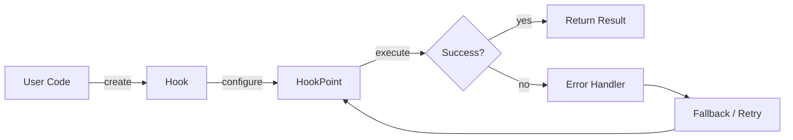
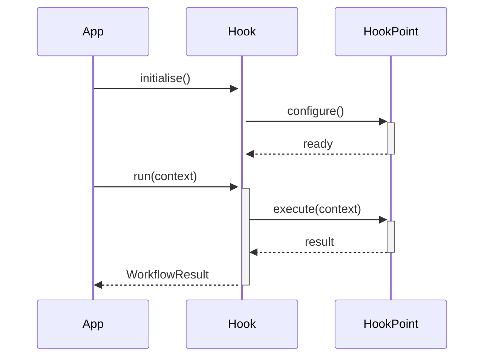

<div align="center">

</div>

# agent-hook

**Lifecycle hooks and middleware for LLM agents**

[](https://pypi.org/project/agent-hook/) [](https://python.org) [](LICENSE) [](#)

---

## The Problem

Without lifecycle hooks, cross-cutting concerns like logging, auth checks, and rate limiting get copy-pasted into every handler. One missed copy means a security gap; one wrong order means a race condition.

## Installation

```bash
pip install agent-hook
```

## Quick Start

```python
from agent_hook import Hook, HookPoint, MiddlewareChain

# Initialise
instance = Hook(name="my_agent")

# Use
# see API reference below
print(result)
```

## API Reference

### `Hook`

```python
class Hook:
    """A single lifecycle handler bound to a HookPoint.
    def __init__(
    def execute(self, *args: Any, **kwargs: Any) -> Any:
        """Invoke the handler with the given arguments."""
    def __repr__(self) -> str:  # pragma: no cover
```

### `HookPoint`

```python
class HookPoint(Enum):
    """Lifecycle points at which hooks can be registered."""
```

### `MiddlewareChain`

```python
class MiddlewareChain:
    """Wraps a target callable with ordered before/after middleware layers.
    def __init__(self, func: Callable) -> None:
    def before(self, middleware: Callable) -> "MiddlewareChain":
        """Append a *before* middleware and return self for fluent chaining."""
    def after(self, middleware: Callable) -> "MiddlewareChain":
        """Append an *after* middleware and return self for fluent chaining."""
    def __call__(self, *args: Any, **kwargs: Any) -> Any:
        """Execute the full before → func → after pipeline."""
```


## How It Works

### Flow



### Sequence



## Philosophy

> *Sankalpa* — the sacred intention set before ritual — is the hook that fires before and after every action.

---

*Part of the [arsenal](https://github.com/darshjme/arsenal) — production stack for LLM agents.*

*Built by [Darshankumar Joshi](https://github.com/darshjme), Gujarat, India.*
